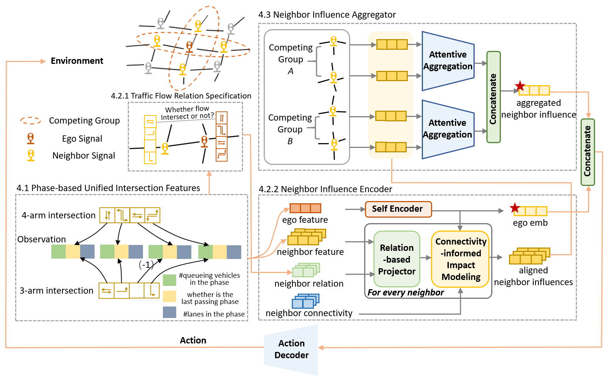

# CityLight

This repo is the official implementation for the CIKM 2025 paper:   
CityLight: A Neighborhood-inclusive Universal Model for Coordinated City-scale Traffic Signal Control

## Overall architecture
This work aims to learn a universal policy that achieves neighborhood-inclusive coordination for heterogeneous and intricate real-world intersections. Built on the parameter-sharing MAPPO framework, CityLight learns an aligned representation for different intersection configurations and their complex neighborhood influences. With the aligned representations, the policy network learns a universal policy that fit heterogeneous intersections with intricate neighborhood impacts. 



## Data
We use one benchmark dataset in the TSC field, the Manhattan dataset that comprises 196 intersections, and construct four more datasets from real world to fully evaluate CityLight's effectiveness for tackling intricate and heterogeneous intersections.Specifically, there are two region-scale datasets and two city-scale datasets. The overall statistics of the five datasets is shown in the following table. 

| Datasets                 | Manhattan | Chaoyang  | Central Beijing | Beijing    | Jinan     |
|--------------------------|-----------|-----------------|------------|-----------|-----------|
| \#Intersections          | 196        | 97        | 885             | 13952      | 4064      |
| \#Three-phase intersections | 0         |  49        | 630             | 9752       | 2466      |
| \#Four-phase intersections | 196       |48        | 255             | 4200       | 1595      |
| \#Roads                  | 854         |608       | 4640            | 76806      | 23950     |
| Covered Area             |  25.3 km²  |   14.2 km²  | 79.3 km²      | 3104.4 km² | 1477.5 km²|
| \#Agents                 | 16317      |9000      | 55429           | 143298     | 99712     |

Due to the size limit of github, we have stored the data in a google drive link: https://drive.google.com/drive/folders/1LxsdybT5Ai1AUjGT4m6Ku-951zEehU7Y?usp=drive_link. Please download them and place them inside /data.

## Installation
### Environment
- Tested OS: Linux
- Python >= 3.8
- torch == 2.2.1
- Tensorboard
  
### Dependency for Simulation Environment
To achieve high-fidelity city-scale traffic simulation, we incorporate MOSS (MObility Simulation System) as our simulation environment. The detailed introduction of MOSS can be refered to in: https://arxiv.org/abs/2405.12520. To install MOSS, you have to follow these instructions (under this directory):

1. construct the docker
```
docker build -t simulet . 
```
2. start the docker and mount the outside data to the directory inside docker.
```
docker run --runtime=nvidia --gpus all --name simulet \
--mount type=bind,source=/absolute_path_of_this_directory,target=/root/TSC-example \
-d simulet     
```
3. enter the docker
```
docker exec -w /root -it simulet zsh
```

### Other Dependencies
1. Use the ```pip install -r TSC-example/requirements.txt``` command for all other Python modules and packages used in this project.

## Config 
Configs for performance reproductions on all datasets. 
Execute in /TSC-example.


### Chaoyang
```
python main.py \
  --data data/beijing_chaoyang \
  --steps 3600 \
  --lr 5e-4 --critic_lr 5e-4 \
  --buffer_episode_size 60 \
  --cuda_id 0 \
  --ppo_epoch 16 --training_step 10000000 \
  --algo mp_builtin --interval 15 \
  --agg 1 --attn type_attn --distance 2 \
  --reward one_hop_queue \
  --num_mini_batch 6 --layer_N 2 --alpha 0.2
```

### Central Beijing
```
python main.py \
  --data data/central_beijing \
  --steps 3600 \
  --lr 5e-4 --critic_lr 5e-4 \
  --buffer_episode_size 12 \
  --cuda_id 0 \
  --ppo_epoch 16 --training_step 10000000 \
  --algo mp_builtin --interval 15 \
  --agg 1 --attn type_attn --distance 2 \
  --reward one_hop_queue \
  --num_mini_batch 4 --layer_N 2 --alpha 0.2
```

### Jinan
```
python main.py \
  --data data/jinan \
  --steps 3600 \
  --lr 5e-4 --critic_lr 5e-4 \
  --buffer_episode_size 12 \
  --cuda_id 0 \
  --ppo_epoch 10 --training_step 10000000 \
  --algo mp_builtin --interval 15 \
  --agg 1 --attn type_attn --distance 2 \
  --reward one_hop_queue \
  --num_mini_batch 18 --layer_N 2 --alpha 0.2
```

### Beijing
```
python main.py \
  --data data/beijing \
  --steps 3600 \
  --lr 5e-4 --critic_lr 5e-4 \
  --buffer_episode_size 4 \
  --cuda_id 0 \
  --ppo_epoch 10 --training_step 10000000 \
  --algo mp_builtin --interval 15 \
  --agg 1 --attn type_attn --distance 2 \
  --reward one_hop_queue \
  --num_mini_batch 18 --layer_N 2 --alpha 0.2
```

### Manhattan
```
python main.py \
  --data data/manhattan \
  --steps 3600 \
  --lr 5e-4 --critic_lr 5e-4 \
  --buffer_episode_size 120 \
  --cuda_id 0 \
  --ppo_epoch 16 --training_step 10000000 \
  --algo mp_builtin --interval 15 \
  --agg 1 --attn type_attn --distance 2 \
  --reward one_hop_queue \
  --num_mini_batch 12 --layer_N 2 --alpha 0.2
```
